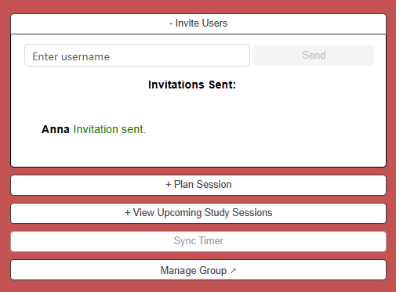
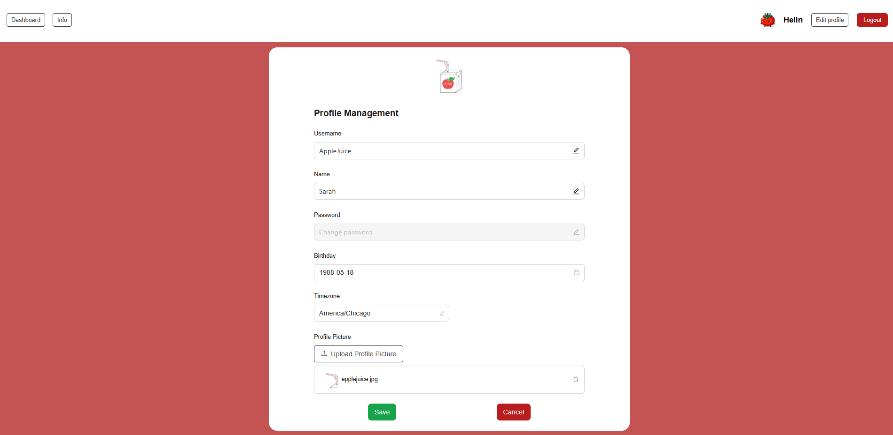

# Pomodoro Time Tracking app

## Group 11 (SOPRA fs-25)

Studying or working alone at home can feel isolating and unmotivating — and it’s easy to lose focus. That’s where our app comes in.

We created a web-based Pomodoro timer app that lets people study together in real time, even if they’re not in the same place. Users can join or create study groups, see each other’s live timer status, chat within the group, sync timers, and even plan sessions using Google Calendar.

Our goal was to build something that helps people stay connected and focused while studying remotely. Whether you’re working alone or as part of a group, our app helps bring structure to your time, makes studying feel a bit more social, and boosts motivation — all through a familiar and effective time management method.


## Built With

- [NextJS](https://nextjs.org/) - The TS frontend framework
- [Vercel](https://vercel.com/) - Deployment platform
- [npm](https://www.npmjs.com/) - Node package manager
- [Ant design componenets](https://ant.design/) - Componenets library

## High level components

### 1. Authentication, User Profile and Dashboard
**Role:** Handles user login, registration, and profile editing. And the dashboard displays user-specific information such as groups and invites.

**Files:** [register](https://github.com/luciocanepa/SOPRA_group11_client/blob/main/app/register/page.tsx), [login](https://github.com/luciocanepa/SOPRA_group11_client/blob/main/app/login/page.tsx), [user dashboard](https://github.com/luciocanepa/SOPRA_group11_client/blob/main/app/dashboard/page.tsx), [profile editing](https://github.com/luciocanepa/SOPRA_group11_client/blob/main/app/users/%5Bid%5D/edit/page.tsx), [navigation bar](https://github.com/luciocanepa/SOPRA_group11_client/blob/main/app/components/Navbar.tsx)

### 2. Group Dashboard and Member Status
**Role:** Displays information about the current group, including members and their current status (online/offline/work/break), as well as real-time timer countdown in the cases of break/work status. The group dashboard also displays all the other components such as the timer, chat and important buttons such as the one to add more members.

**Files:** [group dashboard](https://github.com/luciocanepa/SOPRA_group11_client/blob/main/app/groups/%5Bgid%5D/page.tsx), [group participants display](https://github.com/luciocanepa/SOPRA_group11_client/blob/main/app/components/GroupParticipants.tsx), [participants handling](https://github.com/luciocanepa/SOPRA_group11_client/blob/main/app/hooks/useGroupParticipants.tsx), [sending invitations](https://github.com/luciocanepa/SOPRA_group11_client/blob/main/app/components/InviteUser.tsx)

### 3. Pomodoro Timer and Sync Functionality
**Role:** Central component of our application is the timer.We are able to manage study and break intervals by custumizing it. Start, Stop and Reset as much as we like. When the timer is running we are able to send `Sync Timer` requests which allows group members to accept the sender's timer settings in order to spend the break together.

**Files:** [timer](https://github.com/luciocanepa/SOPRA_group11_client/blob/main/app/components/PomodoroTimer.tsx), *([sync requests](https://github.com/luciocanepa/SOPRA_group11_client/blob/main/app/groups/%5Bgid%5D/page.tsx) handled in the group dashboard file)*

### 4. Chat
**Role:** Enables real-time messaging among group members, available only during breaks, before and after study sessions.

**Files:** [chat](https://github.com/luciocanepa/SOPRA_group11_client/blob/main/app/components/Chat.tsx), [chat handling](https://github.com/luciocanepa/SOPRA_group11_client/blob/main/app/hooks/useChatMessages.tsx)

### 5. Google Calendar API
**Role:** Group members are able to log in with their Google accounts and schedule study sessions. The sessions will automatically be stored in their Google Calendar. Other group members can view the study sessions that have been scheduled within the group, and add them to their Calendar by button click.

**Files:** [Google Account handling](https://github.com/luciocanepa/SOPRA_group11_client/blob/main/app/hooks/useGoogleCalendarAPI.ts), [schedule sessions](https://github.com/luciocanepa/SOPRA_group11_client/blob/main/app/components/CalendarAPI.tsx), [display sessions](https://github.com/luciocanepa/SOPRA_group11_client/blob/main/app/components/ScheduledSessions.tsx)

### Correlation
All our high-level components are correlated through our user flow which are made visible in the [Illustrations](#illustrations) section. Apart from the [first component](#1-authentication-user-profile-and-dashboard), all are displayed in the group dashboard. Thus showcasing the importance of collaborative work for our users through studying, chatting and planning future work together.

## Launch & deployment

These instructions will get you a copy of the project up and running on your local machine for development and testing purposes. See deployment for notes on how to deploy the project on a live system.

1. Clone the repo locally:

```bash
git clone git@github.com:luciocanepa/SOPRA_group11_client.git
```

2. make sure you have [node.js](https://nodejs.org/en) installed

```bash
node -v
```

3. npm comes together with the installation of node:

```bash
npm -v
```

3. install all packages locally:

```bash
npm install
```

4. you can build or run the application locally (dev) using nextJS framework:

```bash
npm run build
```

```bash
npm run dev
```

5. The app has 3 worklflows for deployment:

- `build.yml`: Run the NextJS builder and generate pages
- `verceldeployment.yml`: after build, send the pages over to vercel to expose them at [https://sopra-fs25-group-11-client.vercel.app/](https://sopra-fs25-group-11-client.vercel.app/)
- `dockerize.yml`: workflow that creates the docker container for the application


## Illustrations
Here's a walkthrough of the core interface and features:

### 1. *Homepage & Introduction*
Users land on the homepage that explains the app’s purpose and how to get started. From there, they can choose to either login or sign up.<br><br>


---

### 2. *Register & Log In*
New users can sign up quickly with their unique username and their chosen password to start using the app.<br><br>


---

### 3. *User Dashboard*
Once logged in, users land on the dashboard, where they can see their existing groups, join them or create new ones, and navigate to key features such as statistics, or the individual Pomodoro Timer.<br><br>


---

### 4. *Create Study Groups*
Users can create a new group, set its name and description, upload a group image, and invite other users. They can also manage group details later.  <br><br>


---

### 5. *Manage Groups*
The group admin can edit group information, remove users from the group, or delete the group entirely.<br><br>


---

### 6. *Invite Users*
As seen above, group members can invite users by username either on the group creation page or from the group dashboard.<br><br>


---

### 7. *Schedule Study Sessions*
On the group dashboard, users can schedule sessions and sync them with Google Calendar, making it easy to plan collaborative sessions.<br>

<p float="left">
  
  
</p>

---

### 8. *Syncing Timers Across Users*
Timers can be synced between group members for real-time collaboration.<br><br>


---

### 9. *Group Dashboard & Collaborative Pomodoro Timer*
Each study group features a Pomodoro timer, a member list showing each member’s status and the time remaining on their timer, a chat window, and buttons for the other features mentioned above.<br><br>


---

### 10. *Individual Timer View*
Users can also use the timer in a focused, distraction-free single mode, which is accessible from the dashboard.<br><br>


---

### 11. *Statistics - Track Study Progress*
Users can view their study statistics by group and time, visualized clearly via bar charts.<br><br>


---

### 12. *Edit Profile*
Each user can update personal details, profile picture, timezone, and password from the profile page.<br><br>


---

### 13. *Info Button / Info Carousel*
The info button explains the functionalities mentioned on the home page again.<br><br>


---

### 14. *App Navigation*
The dashboard, info carousel, user edit page, and logout are all accessible via a consistent navigation bar for a smooth user experience.<br><br>


## Roadmap

We have built the core functionalities of our collaborative Pomodoro Application, but there are a few features and improvements that could be added to enhance the user experience even more. Therefore, future developers may consider the following additions:

#### 1. Real-Time Group Sync via WebSockets

**Goal:** Improve group responsiveness by updating group membership in real time.

**Description:** When a user joins or leaves a group, the change should be visible instantly for all other group members using WebSockets instead of requiring a manual page refresh on the group dashboard.

#### 2. Invite User via WebSocket
**Goal:** Improve user invitation flow and interactivity.

**Description:** Receiving group invitations should appear in real-time on the user's dashboard, without having to refresh their user dashboard in order to view it. This should ideally be solved via WebSocket.

#### 3. Enhanced Chat Features
**Goal:** Make the break-time chat more interactive and engaging.

**Suggestions:**
- Add message reactions or emojis to quickly reflect and show emotions
- Show who is currently typing
- Enable replies to a specific message / reference a message by tagging it
- Have private (1 on 1) chat rooms within the group (and/or outside of the group)

#### 4. Increased Gamification & Break Activities
**Goal:** Encourage user engagement and make breaks more enjoyable.

**Suggestions:**
- Introduce short mini-games during break sessions (like tic tac toe, rock paper scissors or hangman)
- Add a leaderboard or continuous streak counter 
- Implement reward badges for consistent study behavior
- Group-based achievements to build team motivation and measure your groups with others (e.g. a group gets a reward for each day, as long as all group members have spent some time studing.)


## Authors

| Name | Email | Matriculation Number | GitHub Account |
|------|--------|-------------------|----------------|
| Lucio Canepa (group leader) | <lucio.canepa@uzh.ch> | 21-915-905 | luciocanepa |
| Anna Pang | <anna.pang@uzh.ch> | 17-968-660 | annapangUZH |
| Sharon Kelly Isler | <sharonkelly.isler@uzh.ch> | 19-757-103 | sharonisler |
| Moritz Leon Böttcher | <moritzleon.boettcher@uzh.ch> | 23-728-371 | moritzboet |
| Helin Capan | <helin.capan@uzh.ch> | 21-718-895 | HelinCapan |

## License

MIT License

Copyright (c) 2025 SOPRA-fs-25-group-11

Permission is hereby granted, free of charge, to any person obtaining a copy
of this software and associated documentation files (the "Software"), to deal
in the Software without restriction, including without limitation the rights
to use, copy, modify, merge, publish, distribute, sublicense, and/or sell
copies of the Software, and to permit persons to whom the Software is
furnished to do so, subject to the following conditions:

The above copyright notice and this permission notice shall be included in all
copies or substantial portions of the Software.

THE SOFTWARE IS PROVIDED "AS IS", WITHOUT WARRANTY OF ANY KIND, EXPRESS OR
IMPLIED, INCLUDING BUT NOT LIMITED TO THE WARRANTIES OF MERCHANTABILITY,
FITNESS FOR A PARTICULAR PURPOSE AND NONINFRINGEMENT. IN NO EVENT SHALL THE
AUTHORS OR COPYRIGHT HOLDERS BE LIABLE FOR ANY CLAIM, DAMAGES OR OTHER
LIABILITY, WHETHER IN AN ACTION OF CONTRACT, TORT OR OTHERWISE, ARISING FROM,
OUT OF OR IN CONNECTION WITH THE SOFTWARE OR THE USE OR OTHER DEALINGS IN THE
SOFTWARE.

## Acknowledgments

- Hat tip to anyone whose code was used
- Inspiration
- etc
